# CostNest <a href=""></a>

**CostNest is an enterprise-grade Chrome extension engineered for comprehensive expense tracking and financial analysis. Built with modern web technologies and security best practices, it provides organizations and individuals with robust tools for managing online shopping expenses, budget monitoring, and financial data visualization.**
**CostNest - Your Smart Shopping Companion** 🛍️💰

<hr>

## Key Features

### Security & Authentication
- **Multi-layer PIN Authentication** - Enterprise-grade security with encrypted local storage
- **Data Privacy Compliance** - Zero data transmission, complete local data sovereignty
- **Secure Backup Infrastructure** - Encrypted backup and restore capabilities with data integrity validation

### Financial Management
- **Advanced Expense Categorization** - Intelligent categorization with machine learning suggestions
- **Real-time Budget Monitoring** - Dynamic budget tracking with threshold alerts and notifications
- **Multi-currency Support** - International currency conversion and tracking capabilities
- **Comprehensive Reporting** - Detailed analytics with exportable CSV reports

### User Experience
- **Material Design Implementation** - Modern UI/UX following Google's design principles
- **Responsive Interface** - Glassmorphism design language with cross-device compatibility
- **Interactive Data Visualization** - Chart.js powered analytics dashboards

### Automation & Intelligence
- **Automated Price Detection** - Real-time e-commerce price monitoring and capture
- **Smart Notifications** - Context-aware alerts for spending patterns and budget thresholds
- **OCR Integration** - Receipt scanning and automatic expense entry capabilities
- **Browser Integration** - Seamless integration with Chrome's context menu and tab system

<hr>

## Extention Preview

<p align="left">
  
  
      
</p>

<hr>

## Installation Guide

### Production Deployment

**Note:** This extension is currently in development phase. For production use, it will be available through the Chrome Web Store.

### Development Installation

#### Prerequisites
- Google Chrome Browser (Version 88+)
- Developer Mode Access
- Administrative Privileges (for extension installation)

#### Installation Steps

1. **Repository Setup**
   ```bash
   git clone <repository-url>
   cd costnest-extension
   ```
   *Alternative: Download and extract the source code to your preferred directory*

2. **Chrome Extension Configuration**
   - Navigate to `chrome://extensions/` in your Chrome browser
   - Enable "Developer mode" toggle (top-right corner)
   - Select "Load unpacked extension"
   - Choose the CostNest project directory

3. **Extension Activation**
   - Locate CostNest in your Chrome extensions list
   - Ensure the extension is enabled
   - Pin the extension to your toolbar for quick access

4. **Initial Configuration**
   - Click the CostNest extension icon
   - Complete the initial PIN setup process
   - Configure your preferred settings and currency options
<hr>

## User Guide

### Initial Setup and Configuration

1. **Security Configuration**
   - Access the extension through the Chrome toolbar
   - Set up a secure 4-6 digit PIN for data protection
   - Configure security preferences and data retention policies

2. **Application Configuration**
   - Define preferred currency and regional settings
   - Set up expense categories and custom tags
   - Configure notification preferences and alert thresholds

### Expense Management Workflows

#### Manual Expense Entry
1. Access the CostNest interface via the Chrome toolbar
2. Authenticate using your configured PIN
3. Select "Add New Expense" from the main dashboard
4. Complete the expense entry form with required details:
   - Transaction amount and currency
   - Expense description and category
   - Date and additional metadata
5. Save the transaction to your local database

#### Automated Expense Capture
- **E-commerce Integration**: Automatic detection and capture of product information on supported e-commerce platforms
- **Context Menu Integration**: Right-click on product links or prices to quickly add expenses
- **Smart Form Population**: Automatic form filling with detected product and pricing data

### Data Management and Analytics

#### Financial Reporting
- **Dashboard Analytics**: Comprehensive spending overview with trend analysis
- **Category-based Reports**: Detailed breakdowns by expense category, date range, and amount
- **Visual Analytics**: Interactive charts and graphs for pattern recognition

#### Budget Management
- **Budget Configuration**: Set monthly, quarterly, or annual spending limits
- **Progress Monitoring**: Real-time budget tracking with visual progress indicators
- **Alert System**: Automated notifications for budget thresholds and spending patterns

#### Data Operations
- **Backup Management**: 
  - Navigate to Settings → Data Management → Backup
  - Export encrypted backup files for secure storage
- **Data Restoration**: 
  - Access Settings → Data Management → Restore
  - Import previously created backup files
- **CSV Export**: 
  - Generate detailed expense reports in CSV format
  - Compatible with popular spreadsheet and accounting software

<hr>

## Technical Architecture

### Technology Stack
- **Extension Framework**: Chrome Extension Manifest V3
- **Data Visualization**: Chart.js v3.x with custom configurations
- **UI Framework**: Material Design Components with custom glassmorphism implementation
- **Typography**: Bungee font family for distinctive branding
- **Security**: Web Crypto API for data encryption and authentication

### System Architecture

#### Mermaid File Structure Graph

```mermaid
flowchart TB
    A[CostNest<br/>Chrome Extension] 
    
    %% Root Files
    A --- B[manifest.json<br/>Extension Config]
    A --- C[popup.html<br/>Main Interface]
    A --- D[background.js<br/>Service Worker]
    A --- E[content.js<br/>Content Script]
    A --- F[README.md<br/>Documentation]
    
    %% Styles Folder
    A --- G[styles/]
    G --- G1[popup.css<br/>Glassmorphism Styling]
    
    %% JavaScript Folder
    A --- H[js/]
    H --- H1[auth.js<br/>PIN Authentication]
    H --- H2[storage.js<br/>Data Management]
    H --- H3[expenses.js<br/>Expense Handling]
    H --- H4[charts.js<br/>Data Visualization]
    H --- H5[chart-fallback.js<br/>Chart Fallbacks]
    H --- H6[dom-utils.js<br/>DOM Utilities]
    H --- H7[popup.js<br/>Main Controller]
    
    %% Icons Folder
    A --- I[icons/]
    I --- I1[icon16.svg<br/>16x16]
    I --- I2[icon32.svg<br/>32x32]
    I --- I3[icon48.svg<br/>48x48]
    I --- I4[icon128.svg<br/>128x128]
    
    %% Library Folder
    A --- J[lib/]
    J --- J1[chart.min.js<br/>Chart.js Library]
    
    %% Styling
    classDef root fill:#4a90e2,stroke:#2c5282,stroke-width:3px,color:#fff
    classDef folder fill:#68d391,stroke:#38a169,stroke-width:2px,color:#1a202c
    classDef config fill:#f6ad55,stroke:#dd6b20,stroke-width:2px,color:#1a202c
    classDef script fill:#9f7aea,stroke:#6b46c1,stroke-width:2px,color:#fff
    classDef html fill:#f687b3,stroke:#d53f8c,stroke-width:2px,color:#1a202c
    classDef css fill:#63b3ed,stroke:#3182ce,stroke-width:2px,color:#1a202c
    classDef icon fill:#fbb6ce,stroke:#e53e3e,stroke-width:2px,color:#1a202c
    classDef lib fill:#68d391,stroke:#38a169,stroke-width:2px,color:#1a202c
    classDef doc fill:#a78bfa,stroke:#7c3aed,stroke-width:2px,color:#fff
    
    class A root
    class G,H,I,J folder
    class B config
    class D,E,H1,H2,H3,H4,H5,H6,H7 script
    class C html
    class G1 css
    class I1,I2,I3,I4 icon
    class J1 lib
    class F doc
```


### Chrome Extension Permissions


| Permission | Purpose | Security Impact |
|------------|---------|-----------------|
| `storage` | Local data persistence and user preferences | Low - Data stored locally only |
| `activeTab` | Price detection on current browser tab | Medium - Access to current page content |
| `notifications` | Budget alerts and spending notifications | Low - System notification access only |
| `contextMenus` | Right-click menu integration | Low - Context menu modification only |
| `alarms` | Scheduled reminders and maintenance tasks | Low - Timer and scheduling access |
| `host_permissions` | E-commerce website integration | Medium - Specific website access for price detection |

### Security and Privacy Framework

**Data Protection Principles:**
- **Local Data Storage**: All user data stored exclusively on local device storage
- **Zero Data Transmission**: No personal or financial data transmitted to external servers
- **Encryption at Rest**: Sensitive data encrypted using Web Crypto API standards
- **Authentication Security**: PIN-based authentication with secure hashing algorithms
- **Privacy by Design**: No tracking, analytics, or data collection mechanisms implemented

**Compliance Standards:**
- GDPR compliance through data minimization and user control
- Industry-standard encryption protocols
- Transparent data handling practices

<hr>

## Troubleshooting and Support

### Common Issues and Resolutions

#### Extension Loading Issues
**Symptoms:** Extension fails to load or appears inactive
**Resolution Steps:**
1. Verify all project files are present in the installation directory
2. Confirm Developer Mode is enabled in Chrome Extensions settings
3. Reload the extension through the Chrome Extensions management page
4. Clear browser cache and restart Chrome if issues persist

#### Authentication Problems
**Symptoms:** PIN authentication failures or security lockouts
**Resolution Steps:**
1. Navigate to `chrome://extensions/`
2. Locate CostNest extension and select "Extension options"
3. Use the "Reset Security Settings" option to clear authentication data
4. Reconfigure PIN authentication through the setup process

#### Data Visualization Issues
**Symptoms:** Charts fail to render or display incorrectly
**Resolution Steps:**
1. Verify Chart.js library is properly loaded (check browser console)
2. Clear extension storage data to resolve potential data corruption
3. Refresh the extension interface and verify JavaScript execution
4. Check browser compatibility and update Chrome if necessary

#### E-commerce Integration Problems
**Symptoms:** Price detection fails on supported websites
**Resolution Steps:**
1. Verify website compatibility with current extension version
2. Ensure content scripts are properly enabled and executing
3. Clear browser cache and refresh the target webpage
4. Check for browser security settings that may block content script execution

### Performance Optimization

**System Requirements:**
- Chrome Browser Version 88 or higher
- Minimum 50MB available storage space
- Active internet connection for e-commerce integration

**Performance Best Practices:**
- Regular data cleanup and backup maintenance
- Monitor extension memory usage through Chrome Task Manager
- Periodic restart of Chrome browser to clear memory leaks
- Keep extension updated to latest version for optimal performance

<hr>

## Project Documentation

<div style="display: flex; gap: 10px; margin: 15px 0; align-items: center; flex-wrap: wrap;">

[](LICENSE)
[](SECURITY.md)
[](CONTRIBUTING.md)
[](CODE_OF_CONDUCT.md)

</div>
<hr>

## Contact Information


  
[](mailto:labib.45x@gmail.com)
[](https://github.com/la-b-ib)
[](https://www.linkedin.com/in/la-b-ib/)
[](https://la-b-ib.github.io/)


<hr>
