# CostNest - Smart Expense Tracker Chrome Extension

**Developer:** Labib Bin Shahed

CostNest is a secure Chrome extension designed to track and analyze online shopping expenses with advanced features including PIN-lock security, interactive data visualizations, and intelligent expense management.

## 🚀 Features

### Core Features
- **🔐 Secure PIN-Lock Access** - Protect your financial data with PIN authentication
- **💰 Expense Management** - Track and categorize your expenses effortlessly
- **📊 Interactive Data Visualizations** - Beautiful charts powered by Chart.js
- **💾 Data Backup and Restore** - Secure your data with backup/restore functionality
- **📄 CSV Export** - Export your data for external analysis
- **🎯 Monthly Budgeting** - Set and track monthly spending goals
- **🎨 Material Design UI** - Modern interface with glassmorphism effects

### Advanced Features
- **🔔 Price Drop Alerts** - Get notified when tracked items go on sale
- **🎯 Spending Goal Setting** - Set and monitor financial targets
- **🌍 Multi-Currency Support** - Track expenses in different currencies
- **📱 Receipt Capture and OCR** - Scan receipts for automatic expense entry
- **🤖 Smart Category Suggestions** - AI-powered expense categorization
- **🔔 In-App Notifications and Reminders** - Stay on top of your spending

## 🛠 Installation

### Method 1: Developer Mode (Recommended for Testing)

1. **Download the Extension**
   - Clone or download this repository to your local machine
   - Extract the files to a folder (e.g., `CostNest`)

2. **Open Chrome Extensions Page**
   - Open Google Chrome
   - Navigate to `chrome://extensions/`
   - Or go to Menu → More Tools → Extensions

3. **Enable Developer Mode**
   - Toggle the "Developer mode" switch in the top-right corner

4. **Load the Extension**
   - Click "Load unpacked"
   - Select the `CostNest` folder containing the extension files
   - The extension should now appear in your extensions list

5. **Pin the Extension**
   - Click the puzzle piece icon in the Chrome toolbar
   - Find "CostNest" and click the pin icon to keep it visible

## 🎯 Getting Started

### First Time Setup

1. **Click the CostNest icon** in your Chrome toolbar
2. **Set up your PIN** - Choose a secure 4-6 digit PIN for protection
3. **Configure settings** - Set your preferred currency and categories
4. **Start tracking** - Begin adding your expenses!

### Adding Expenses

#### Manual Entry
1. Click the CostNest icon
2. Enter your PIN
3. Click "Add Expense"
4. Fill in the amount, description, and category
5. Click "Save"

#### Web Page Detection
1. Visit any e-commerce website
2. Look for the "Add to CostNest" button on product pages
3. Click it to automatically capture product information
4. Review and save the expense

#### Context Menu
1. Right-click on any price or product link
2. Select "Add to CostNest" from the context menu
3. Complete the expense details

### Managing Your Data

#### Viewing Reports
- Access the dashboard to see spending trends
- View expenses by category, date, or amount
- Analyze your spending patterns with interactive charts

#### Setting Budgets
1. Go to Settings
2. Click "Set Monthly Budget"
3. Enter your budget amount
4. Monitor your progress throughout the month

#### Backup & Export
- **Backup**: Settings → Backup Data → Download backup file
- **Restore**: Settings → Restore Data → Upload backup file
- **CSV Export**: Dashboard → Export → Download CSV

## 🔧 Technical Details

### Built With
- **Manifest V3** - Latest Chrome extension standard
- **Chart.js** - Interactive data visualizations
- **Material Design** - Google's design system
- **Glassmorphism** - Modern UI effects
- **Bungee Font** - Distinctive typography

#### Mermaid File Structure Graph

```mermaid
flowchart TB
    A[CostNest<br/>Chrome Extension] 
    
    %% Root Files
    A --- B[manifest.json<br/>Extension Config]
    A --- C[popup.html<br/>Main Interface]
    A --- D[background.js<br/>Service Worker]
    A --- E[content.js<br/>Content Script]
    A --- F[README.md<br/>Documentation]
    
    %% Styles Folder
    A --- G[styles/]
    G --- G1[popup.css<br/>Glassmorphism Styling]
    
    %% JavaScript Folder
    A --- H[js/]
    H --- H1[auth.js<br/>PIN Authentication]
    H --- H2[storage.js<br/>Data Management]
    H --- H3[expenses.js<br/>Expense Handling]
    H --- H4[charts.js<br/>Data Visualization]
    H --- H5[chart-fallback.js<br/>Chart Fallbacks]
    H --- H6[dom-utils.js<br/>DOM Utilities]
    H --- H7[popup.js<br/>Main Controller]
    
    %% Icons Folder
    A --- I[icons/]
    I --- I1[icon16.svg<br/>16x16]
    I --- I2[icon32.svg<br/>32x32]
    I --- I3[icon48.svg<br/>48x48]
    I --- I4[icon128.svg<br/>128x128]
    
    %% Library Folder
    A --- J[lib/]
    J --- J1[chart.min.js<br/>Chart.js Library]
    
    %% Styling
    classDef root fill:#4a90e2,stroke:#2c5282,stroke-width:3px,color:#fff
    classDef folder fill:#68d391,stroke:#38a169,stroke-width:2px,color:#1a202c
    classDef config fill:#f6ad55,stroke:#dd6b20,stroke-width:2px,color:#1a202c
    classDef script fill:#9f7aea,stroke:#6b46c1,stroke-width:2px,color:#fff
    classDef html fill:#f687b3,stroke:#d53f8c,stroke-width:2px,color:#1a202c
    classDef css fill:#63b3ed,stroke:#3182ce,stroke-width:2px,color:#1a202c
    classDef icon fill:#fbb6ce,stroke:#e53e3e,stroke-width:2px,color:#1a202c
    classDef lib fill:#68d391,stroke:#38a169,stroke-width:2px,color:#1a202c
    classDef doc fill:#a78bfa,stroke:#7c3aed,stroke-width:2px,color:#fff
    
    class A root
    class G,H,I,J folder
    class B config
    class D,E,H1,H2,H3,H4,H5,H6,H7 script
    class C html
    class G1 css
    class I1,I2,I3,I4 icon
    class J1 lib
    class F doc
```

### Permissions
The extension requires the following permissions:
- **storage** - Save your expense data locally
- **activeTab** - Detect prices on current tab
- **notifications** - Send spending alerts
- **contextMenus** - Right-click menu integration
- **alarms** - Scheduled reminders
- **host permissions** - Access e-commerce websites for price detection

## 🔒 Privacy & Security

- **Local Storage Only** - All data is stored locally on your device
- **PIN Protection** - Your data is protected by PIN authentication
- **No Data Collection** - We don't collect or transmit your personal data
- **Secure Encryption** - Sensitive data is encrypted using Web Crypto API

## 🐛 Troubleshooting

### Common Issues

**Extension not loading:**
- Ensure all files are in the correct directory
- Check that Developer mode is enabled
- Refresh the extensions page and try again

**PIN not working:**
- Clear extension data: chrome://extensions → CostNest → Details → Extension options → Reset
- Set up a new PIN

**Charts not displaying:**
- Ensure Chart.js is properly loaded
- Check browser console for JavaScript errors
- Try refreshing the extension

**Price detection not working:**
- Ensure the website is supported
- Check that content scripts are enabled
- Try refreshing the page

## 🤝 Contributing

We welcome contributions! Please feel free to:
- Report bugs
- Suggest new features
- Submit pull requests
- Improve documentation

## 📄 License

This project is licensed under the MIT License - see the LICENSE file for details.

## 📞 Support

For support, feature requests, or bug reports, please contact:
- **Developer:** Labib Bin Shahed
- **Email:** [Your Email]
- **GitHub:** [Your GitHub Profile]

---

**Made with ❤️ by Labib Bin Shahed**

*CostNest - Your Smart Shopping Companion* 🛍️💰
