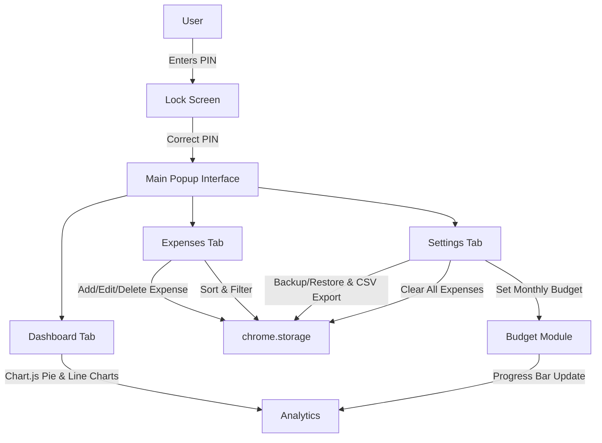

# CostNest — Advanced Expense Tracker Chrome Extension

CostNest is a feature-rich Chrome extension designed to track and analyze your online shopping expenses. Incorporating secure PIN-lock access with auto-lock after inactivity, it empowers you to add, edit, sort, and filter expenses with ease. Interactive data visualizations (pie charts and line charts) provide insights into spending by category and monthly trends. The extension also supports data backup/restore, CSV export, and a monthly budgeting feature via an intuitive Material Design user interface.

---

## Features

- **Secure Access:**  
  - PIN Lock system with default PIN ("1234") and in-app PIN change.
  - Auto-lock after 60 seconds of inactivity.
  
- **Expense Management:**  
  - Add, edit, and delete expenses with fields for item, cost, category, and date.
  - Advanced sorting (by date, cost, or category) and debounced filtering.
  
- **Analytics & Budgeting:**  
  - Live data visualization with Chart.js:  
    - Pie chart (expenses by category).  
    - Line chart (monthly spending trends).
  - Monthly budget tracking with a progress bar showing your current month’s spending as a percentage of your set budget.
  
- **Data Portability:**  
  - Backup and restore expense data in JSON.
  - CSV export functionality.
  - “Clear All Expenses” feature safeguarded by a confirmation modal.
  
- **Modern UI:**  
  - Built with Materialize CSS and Material Icons for a responsive and sleek Material Design interface.
  - Use of Materialize modals, tabs, dropdowns, and datepickers.

---

## Demo Architecture

Below is a high-level flow diagram that illustrates the system architecture and key interactions within CostNest:



*This diagram shows the workflow starting with secure access, moving through expense management, analytics, and settings, with data persistence handled by the Chrome Storage API.*

---

## Technical Stack

- **Frontend:**  
  - HTML5, CSS3, JavaScript (ES6+)
  - [Materialize CSS](https://materializecss.com/) for Material Design components and responsive layout
  - Material Icons from Google

- **Visualization:**  
  - [Chart.js](https://www.chartjs.org/) for interactive pie and line charts

- **Chrome Extension:**  
  - Manifest V3
  - Chrome Storage API for persistence
  - Async programming using Promise-based wrappers (async/await)

- **Utilities:**  
  - Debounce function for optimizing filter input events
  - Auto-lock functionality using JavaScript timers

---

## Installation

1. **Clone/Download the Repository:**  
   Download or clone the project folder to your local machine.

2. **Load the Extension in Chrome:**  
   - Open Chrome and navigate to `chrome://extensions/`
   - Enable **Developer Mode** (toggle in the upper right)
   - Click **Load unpacked** and select the project folder (e.g., `CostNest`)

3. **Using the Extension:**  
   - Click on the CostNest icon in the Chrome toolbar.
   - Enter the default PIN (`1234`) to unlock the extension.
   - Start adding, editing, and managing your expenses!

---

## Usage & Configuration

- **PIN & Security:**  
  Upon unlocking with your PIN, you access the main interface. You can change your PIN in the Settings tab.

- **Expense Tab:**  
  Use the provided form to add expenses with details like name, cost, category, and date. Sorting and filtering options let you view your expenses effortlessly.

- **Dashboard:**  
  Analyze your spending through interactive charts. The monthly budget progress bar helps visualize your current spending against your set monthly budget.

- **Settings:**  
  Backup/restore your data, export as CSV, clear all expenses, or set a new monthly budget—all built with intuitive modals.

- **Auto-lock:**  
  The extension automatically locks after 60 seconds of inactivity on the main screen, reverting to the PIN lock screen.

---

## Contributing

Contributions are welcome! If you have ideas or improvements to enhance CostNest, feel free to fork the repository and open a pull request.

---

Below is a Markdown-formatted explanation along with the GitHub Actions workflow YAML code. You can copy this into a file (for example, `.github/workflows/build.yml`) in your repository at [https://github.com/la-b-ib/CostNest](https://github.com/la-b-ib/CostNest).

---


# GitHub Actions Workflow for CostNest

This GitHub Actions workflow is designed to build and package the CostNest Chrome extension. It automatically triggers on pushes and pull requests to the `main` branch (as well as on manual dispatch) and performs the following steps:

1. **Checkout the Repository:**  
   Uses the official checkout action to access all project files.

2. **Setup Node.js:**  
   Optionally installs Node.js (useful if you add npm-based tooling or scripts in the future).

3. **Install Dependencies:**  
   If a `package.json` file exists (for linting or testing), it runs `npm install`.

4. **Build and Package the Extension:**  
   Packages the extension files (such as `manifest.json`, `popup.html`, `style.css`, `popup.js`, and icons) into a ZIP archive.

5. **Upload the Package Artifact:**  
   The zipped package is uploaded as an artifact for easy download and deployment.

Below is the YAML configuration for the workflow:

```yaml
name: Build and Package CostNest Extension

on:
  push:
    branches: [ "main" ]
  pull_request:
    branches: [ "main" ]
  workflow_dispatch:

jobs:
  build:
    runs-on: ubuntu-latest

    steps:
      - name: Checkout repository
        uses: actions/checkout@v2

      # Optional: Setup Node.js for future enhancements
      - name: Setup Node.js
        uses: actions/setup-node@v2
        with:
          node-version: '16'

      - name: Install Dependencies
        run: |
          if [ -f package.json ]; then
            npm install
          else
            echo "No package.json found, skipping dependency installation."
          fi

      - name: Build and Package Extension
        run: |
          # Create a ZIP archive of the extension files.
          # Adjust the file list as necessary to include all required assets.
          zip -r CostNest.zip manifest.json popup.html style.css popup.js icons/* -x "*.git*" ".github/*"
          
      - name: Upload Package Artifact
        uses: actions/upload-artifact@v2
        with:
          name: CostNest-package
          path: CostNest.zip
```

---

### How This Workflow Works

- **Trigger Configuration:**  
  The workflow runs on any push or pull request targeting the `main` branch, and you can also manually trigger it.

- **Build Job Steps:**
  - **Checkout:**  
    Retrieves your repository files.
  
  - **Setup Node.js:**  
    Installs Node.js version 16 (optional, in case your workflow in the future requires Node.js).
  
  - **Install Dependencies:**  
    Checks for a `package.json` file and installs dependencies if it exists.
  
  - **Build & Package:**  
    Uses the `zip` command to package all necessary extension files into `CostNest.zip`. Adjust the parameters as needed.
  
  - **Upload Artifact:**  
    Saves the created ZIP as an artifact named `CostNest-package`.


---


## Contact

- **Developer**: Labib Bin Shahed
- **Email**: [labib-x@protonmail.com](mailto:labib-x@protonmail.com)  
- **GitHub**: [github.com/la-b-ib](https://github.com/la-b-ib)

---

## License

This project is licensed under the terms of the MIT license. See the [LICENSE](LICENSE) file for details.

---

